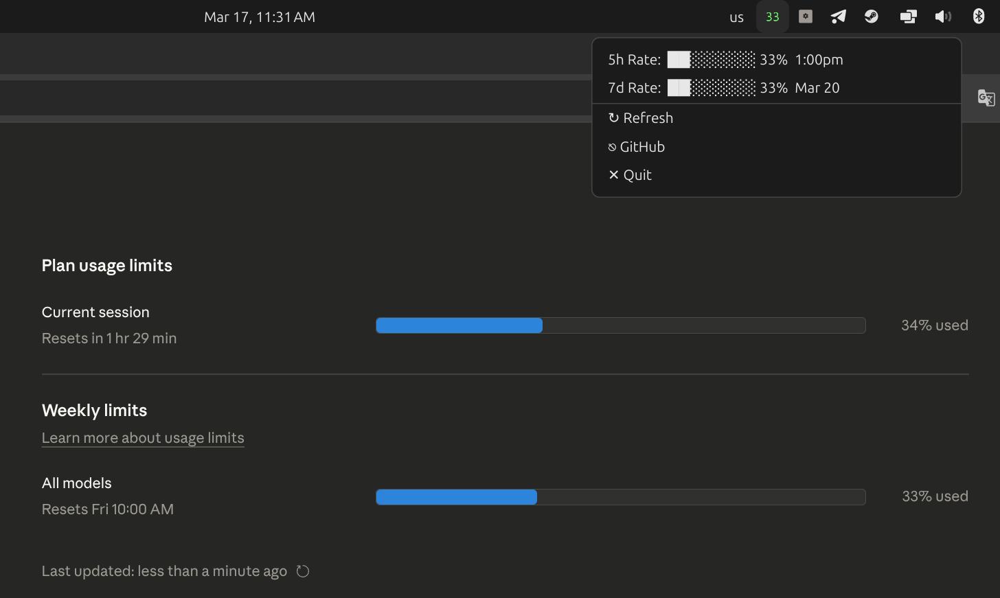

# Claude Usage Tray

[](https://github.com/mrmuminov/claude-usage-tray-go/releases)
[](LICENSE)
[](go.mod)

Cross-platform system tray application that displays Claude Code API usage statistics — 5-hour and 7-day rate limits, extra usage — with auto-refresh and dynamic color-coded icons.



## Features

- **5-hour & 7-day rate limit tracking** with Unicode progress bars and reset times
- **Extra usage display** when applicable
- **Dynamic tray icon** — color-coded by usage level (green ≤50%, yellow ≤80%, red >80%)
- **Auto-refresh** every 60 seconds with manual refresh option
- **Autostart support** on Linux, macOS, and Windows
- **Disk cache** with stale fallback for offline resilience

## Quick Install

### Windows (PowerShell)

```powershell
irm https://raw.githubusercontent.com/mrmuminov/claude-usage-tray-go/master/install.ps1 | iex
```

### macOS / Linux

Download the latest binary from [GitHub Releases](https://github.com/mrmuminov/claude-usage-tray-go/releases), then:

```bash
chmod +x claude-tray-go-*
./claude-tray-go-* install
```

### Download pre-built binaries

| Platform | File |
|----------|------|
| Linux (amd64) | `claude-tray-go-linux-amd64` |
| macOS (arm64) | `claude-tray-go-darwin-arm64` |
| Windows (amd64) | `claude-tray-go-windows-amd64.exe` |

## Build from Source

**Prerequisites:** Go 1.25+

On Linux, install the systray dependency first:

```bash
sudo apt-get install libayatana-appindicator3-dev
```

Then build:

```bash
make build
```

Or directly with Go:

```bash
go build -ldflags="-X main.Version=dev" -o claude-usage-tray-go .
```

### Install & Autostart

```bash
make install
# or
./claude-usage-tray-go install
```

This copies the binary to the platform install directory and configures autostart.

## Usage

Run without arguments to start the tray application:

```bash
./claude-usage-tray-go
```

### CLI Commands

| Command | Description |
|---------|-------------|
| `install` | Copy binary to install dir and configure autostart |
| `uninstall` | Remove autostart config and installed binary |
| `status` | Show installation status |
| `version`, `--version`, `-v` | Print version |

## Authentication

The app resolves an OAuth token using this chain (first match wins):

1. `CLAUDE_CODE_OAUTH_TOKEN` environment variable
2. Platform keychain (`security` on macOS, `secret-tool` on Linux)
3. `~/.claude/.credentials.json`
4. Platform secret store

No manual configuration is needed if you're already logged into Claude Code.

## Platform Support

| | Install directory | Autostart method |
|---|---|---|
| **Linux** | `~/.local/bin/` | XDG `.desktop` file in `~/.config/autostart/` |
| **macOS** | `~/.local/bin/` | LaunchAgent `.plist` in `~/Library/LaunchAgents/` |
| **Windows** | `%LOCALAPPDATA%\claude-usage-tray-go\` | Registry `HKCU\...\Run` key |

## Uninstall

```bash
./claude-usage-tray-go uninstall
```

Windows (PowerShell):
```powershell
& "$env:LOCALAPPDATA\claude-usage-tray-go\claude-usage-tray-go.exe" uninstall
```

## Contributors

- [Bahriddin Muminov](https://github.com/mrmuminov) — creator & maintainer
- [Sharof Soliyev](https://github.com/SharofSoliyev) — contributor

## Contributing

Contributions are welcome! Please read [CONTRIBUTING.md](CONTRIBUTING.md) for guidelines.

## Security

To report security vulnerabilities, please see [SECURITY.md](SECURITY.md).

## License

This project is licensed under the MIT License — see [LICENSE](LICENSE) for details.
